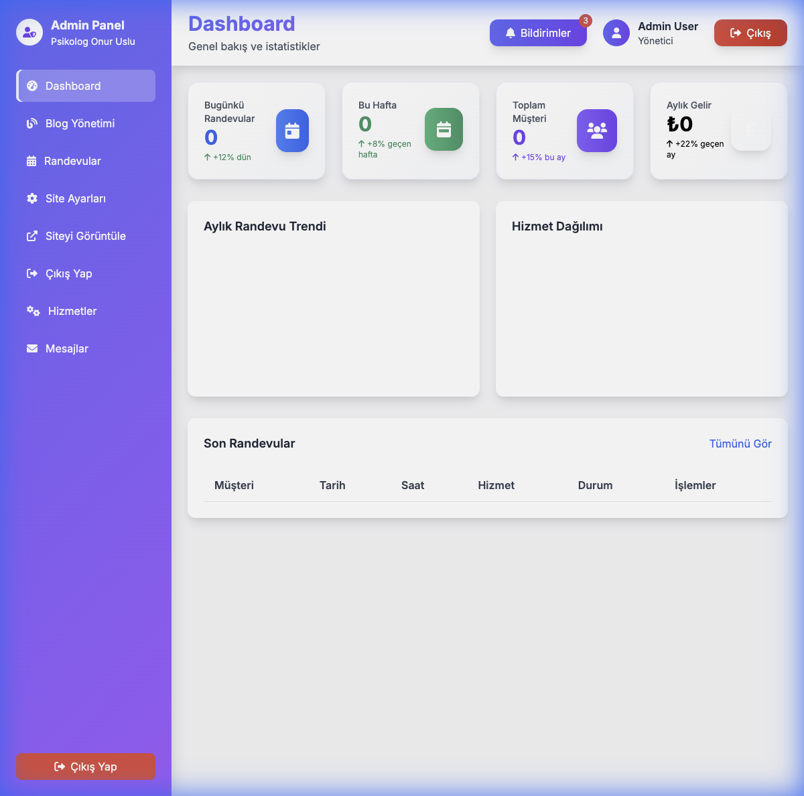

# 🧠 Psikolog Onur Uslu - Official Website


> A modern, responsive, and full-featured website for Clinical Psychologist Onur Uslu, designed to provide a seamless experience for clients and a powerful management tool for the administrator.

<p align="center">
  
</p>

## 📖 Overview

This project is a comprehensive web solution tailored for a psychology clinic. It combines a serene, trust-inspiring frontend design with a robust backend system. Clients can explore services, read blog posts, and book appointments, while the admin can manage the entire practice through a secure dashboard.

## ✨ Key Features

### 🎨 Frontend (Client Side)
*   **Modern & Responsive Design:** Built with **Tailwind CSS**, ensuring a flawless experience on desktops, tablets, and mobile devices.
*   **Dynamic Animations:** Smooth fade-in and slide-up effects using **AOS (Animate On Scroll)**.
*   **Google Reviews Integration:** A styled testimonials section that mimics the credibility of Google Reviews.
*   **Contact Form:** Integrated with the backend API for direct messaging.
*   **Blog Section:** SEO-friendly blog layout to share professional insights.

### 🛡️ Backend & Admin Panel
*   **Secure Authentication:** JWT-based login system for the administrator.
*   **Dashboard:** Real-time overview of appointments and site statistics.
*   **Appointment Management:** Full CRUD capabilities for scheduling, approving, and canceling sessions.
*   **Blog CMS:** A built-in Content Management System to write, edit, and publish articles.
*   **Message Center:** A dedicated inbox to view and reply to inquiries from the contact form.
*   **Mock Data Support:** Intelligent fallback to mock data when the database is disconnected, ensuring development continuity.

## 🛠️ Tech Stack

*   **Frontend:** HTML5, CSS3 (Tailwind), JavaScript (ES6+)
*   **Backend:** Node.js, Express.js
*   **Database:** MongoDB (Mongoose)
*   **Tools:** Swagger (API Docs), Multer (File Uploads), Morgan (Logging)

## 📸 Screenshots

| Admin Dashboard | Mobile View |
|:---:|:---:|
|  |  |

## 🚀 Getting Started

### Prerequisites
*   Node.js (v14 or higher)
*   MongoDB (Local or Atlas)

### Installation

1.  **Clone the repository**
    ```bash
    git clone https://github.com/uslumustafa/PsikologSitesi.git
    cd PsikologSitesi
    ```

2.  **Setup Backend**
    ```bash
    cd backend
    npm install
    cp .env.example .env
    # Edit .env with your MongoDB URI and secrets
    npm start
    ```

3.  **Run Frontend**
    Simply serve the root directory using any static file server.
    ```bash
    # Example using Python
    python3 -m http.server 8080
    ```

4.  **Access the App**
    *   Frontend: `http://localhost:8080`
    *   Admin Panel: `http://localhost:8080/admin/login.html`

## 📂 Project Structure

```
PsikologSitesi/
├── admin/                  # Admin panel HTML/JS files
├── backend/                # Node.js/Express API
│   ├── models/             # Mongoose Schemas
│   ├── routes/             # API Routes
│   └── server.js           # Entry point
├── docs/                   # Documentation & Assets
├── images/                 # Website assets
├── index.html              # Main landing page
├── script.js               # Frontend logic
└── style.css               # Custom styles & Tailwind imports
```

## 🤝 Contributing

Contributions, issues, and feature requests are welcome! Feel free to check the [issues page](https://github.com/uslumustafa/PsikologSitesi/issues).

## 📝 License

This project is [MIT](LICENSE) licensed.

---
<p align="center">
  Made with ❤️ for Psikolog Onur Uslu
</p>
